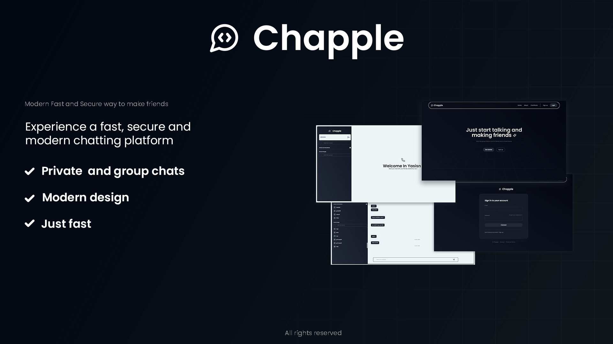
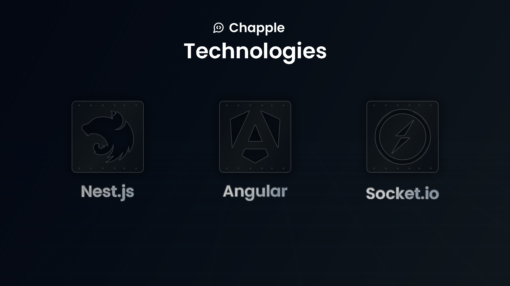

# Chapple
Simple chat application featuring modern design and focuses on chatting.

## Tech stack used

 

**Details**

- Angular Version 16 for frontend
- TailwindCSS and Sass for styling
- Socket io (server and client) for websocket communication
- Nest js for backend

## Features

- Authorization
- Real time communication
- Groups and private messages
- Modern design

## Futur improvement

- State Managing
- Responsive and efficient chat design
